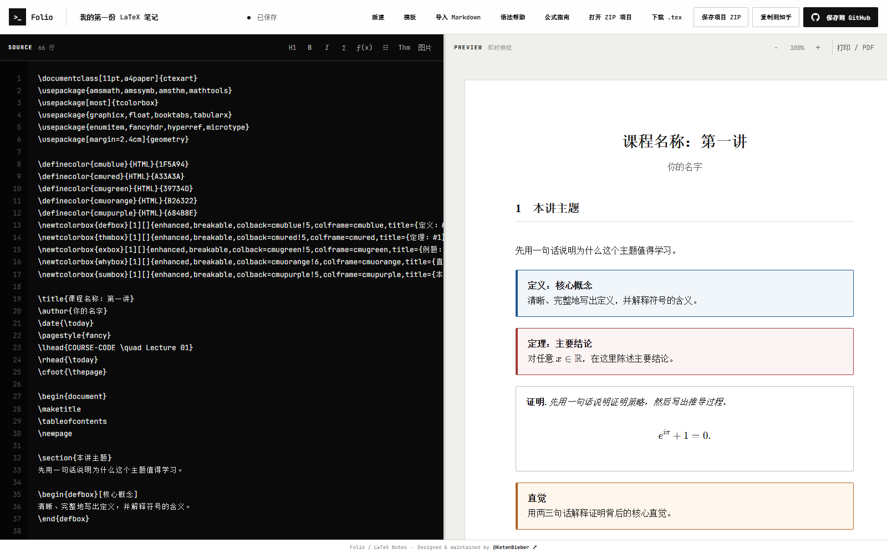
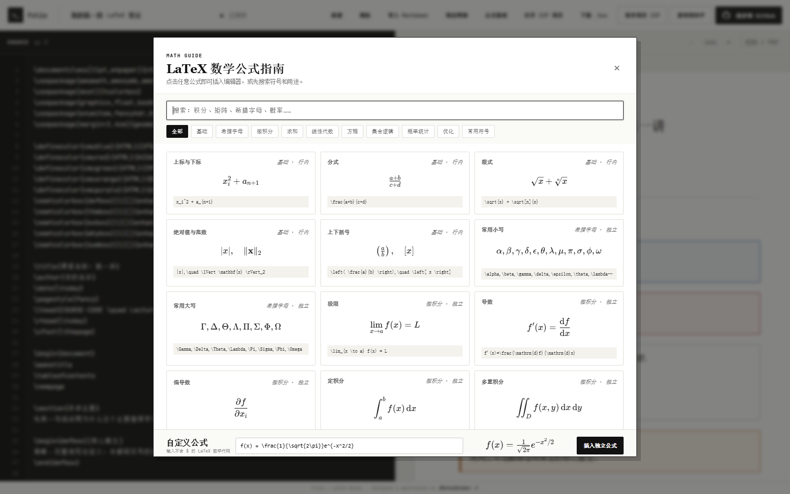

# Folio — Browser LaTeX Notes

> 零安装、浏览器即用的 LaTeX 笔记工作台。

[](#快速开始)
[](#快速开始)
[](#项目格式)

## 界面预览

### LaTeX 编辑与即时排版



### 数学公式指南与一键插入



一个零安装、纯浏览器的 LaTeX 笔记工作台。支持 CMU 风格课程笔记、实时快速预览、语法速查、图片、本地恢复草稿、标准 LaTeX ZIP 项目，以及 GitHub 保存。

另外支持将 Markdown 转换进 CMU LaTeX 模板，以及复制为适合粘贴到知乎文章编辑器的富文本。

## 功能

- CMU Notes 风格课程笔记模板
- 五级标题即时预览、层级编号、自动目录和源码双向定位
- LaTeX 与数学公式即时预览，支持 `equation` 按文档位置自动编号，并在中间插入时同步整理自动标签与 `\label`/`\eqref` 引用
- 源码与预览范围级双向定位：标题、段落、公式、盒子和表格单元格优先精确映射；左侧选词后可定位预览，右侧双击文字可反选源码
- 可点击左侧行号选中整行（包含换行符），便于整行复制、剪切或删除
- 38 个分类公式模板、搜索、自定义预览和一键插入
- 可配置行列数、表头和表题的一键表格生成器，自动创建 `tabularx`、表号及唯一 `\label`
- 工具栏直接插入分点、编号列表和 `verbatim` 代码块，并可给选中文字添加多色荧光标记或文字颜色
- A4 多页 PDF 导出：打印前强制刷新最新排版，自动分页并避免被编辑器视口裁成一页
- Markdown 语法树转换，支持标题、嵌套列表、引用、表格、代码和公式
- 本地图片选择或剪贴板直接粘贴，并与 `main.tex` 一起导出
- `.tex`、项目 ZIP、知乎 Markdown、PDF 默认名和 GitHub 文件名统一跟随文档标题
- IndexedDB + localStorage 双层崩溃恢复；每个浏览器窗口/标签页拥有独立笔记会话
- 标准 LaTeX ZIP 项目导入/导出
- GitHub Contents API 保存
- 知乎双格式复制：优先写入带内联样式的富文本，同时附带 Markdown 纯文本后备
- 知乎兼容 Markdown 转换会隔离公式与代码后再处理正文，避免 LaTeX 命令、反斜杠和下划线被 Markdown 二次解释
- 响应式分栏：中等宽度保持左右双栏，窄屏上下各占半屏并独立滚动

## 快速开始

下载或克隆仓库：

```bash
git clone https://github.com/KetenBieber/latex-note-tools.git
cd latex-note-tools
```

直接双击 `index.html` 即可。为获得稳定的剪贴板、CDN 和 GitHub API 支持，也可以使用任意静态服务器：

```bash
cd latex-notes
python -m http.server 4173
```

访问 <http://localhost:4173>。应用本身不需要安装 Node.js、LaTeX、MiKTeX 或 TeX Live；上面的 Python 命令只是可选静态服务器。

## 使用

1. 点击“模板”选择笔记类型；默认是 CMU 风格课程笔记。
2. 左侧编辑，右侧即时预览。左侧选中文字后点击“↔ 定位”（或按 `Alt + Enter`）即可在预览中高亮对应文字；直接双击左侧单词也可以定位。
3. 单击左侧行号可选中整行；双击右侧预览中的文字，会在左侧选中对应的 LaTeX 源码，单击段落则定位到对应源码范围的起始行。
4. 工具栏可以一键插入分点、编号列表、代码块、表格和图片；选中文字后可直接选择荧光或文字颜色。
5. 表格插入后直接修改占位单元格，并使用生成的 `\label{tab:table-N}` 与 `\ref{tab:table-N}` 交叉引用表号。
6. 点击“公式指南”或工具栏的 `ƒ(x)`，搜索并一键插入数学公式。
7. 点击预览栏“导出 PDF”，在浏览器打印面板中选择“另存为 PDF”；长文档会自动排成多张 A4 页面。
8. 点击“保存项目 ZIP”下载标准项目包；下次点击“打开 ZIP 项目”恢复正文和图片。

## Markdown 与知乎

- 点击“导入 Markdown”选择 `.md` 或 `.markdown` 文件。
- 标题、分点、编号、引用、粗斜体、链接、代码块和数学公式会转换成 LaTeX。
- Markdown 首个 `#` 会成为文档标题，正文的 `##` 到 `######` 依次映射为 `section`、`subsection`、`subsubsection`、`paragraph` 和 `subparagraph`。
- Markdown 引用会转换为 CMU 风格的“直觉”盒子。
- Markdown 远程或相对图片会保留为图片引用提示；建议再用“图片”按钮把本地图片加入项目 ZIP。
- 点击“一键复制到知乎”会同时准备 `text/html` 与 `text/plain`：支持富文本剪贴板的浏览器会保留标题、列表、代码、表格、颜色和荧光样式，不支持时自动使用兼容复制或 Markdown 后备；也可以单独下载知乎 Markdown。
- 知乎 Markdown 固定使用文章标题 `#`，并将 `section` 到 `subparagraph` 严格映射为 `##` 到 `######`；带星号标题、跨行标题和 `\section[短标题]{完整标题}` 均保持正确层级与块间空行。
- 行内公式统一导出为 `$...$`，独立公式统一导出为 `$$...$$`；`align`、`gather`、`multline` 会转换为 Markdown 数学块内可渲染的对齐结构，公式内部的 `\\`、`_`、`^` 和命令不会被正文转换器修改。
- `\_`、`\%`、`\&`、`\$`、`\#`、省略号和 LaTeX 空格会按 Markdown 语义转义；嵌套粗体/斜体、嵌套列表、CMU 提示框及 `\ref`/`\eqref` 也会保留对应结构。

知乎粘贴后应检查公式和图片。平台编辑器可能过滤外部样式，本地图片通常需要在知乎侧重新确认上传。

## 项目格式

Folio 不使用私有文档格式。导出的 ZIP 内部是普通 LaTeX 结构：

```text
main.tex
images/
  figure.png
README.txt
```

可以解压后使用任意 LaTeX 编辑器，也可以上传 ZIP 到 Overleaf。项目使用标准的 `.tex` 和图片文件，不依赖 Folio 私有格式。

## 常用快捷键

| 快捷键 | 功能 |
| --- | --- |
| `Ctrl/⌘ + S` | 立即更新浏览器恢复草稿 |
| `Ctrl/⌘ + Shift + S` | 下载标准 LaTeX ZIP 项目 |
| `Ctrl/⌘ + Z` | 撤销输入、工具栏操作或公式/表格/图片插入 |
| `Ctrl/⌘ + Shift + Z` / `Ctrl/⌘ + Y` | 重做 |
| `Ctrl/⌘ + /` | 切换当前行或所选多行的 LaTeX `%` 注释 |
| `Ctrl/⌘ + B` | 将所选文字包裹为 `\textbf{...}` |
| `Ctrl/⌘ + I` | 将所选文字包裹为 `\textit{...}` |
| `Ctrl/⌘ + Shift + M` | 将所选内容包裹为独立数学公式 |
| `Ctrl/⌘ + Alt + M` | 插入带自动编号和唯一标签的 `equation` 公式 |
| `Alt + Enter` | 把左侧当前选中文字定位并高亮到右侧预览 |
| `Tab` | 在编辑器插入两个空格 |
| `Ctrl/⌘ + V` | 直接粘贴剪贴板图片并插入标准 figure |

## 自动恢复与稳定性

- 每次输入停止片刻后，正文会写入浏览器 IndexedDB 恢复区；图片只在新增、导入或清空时单独重写，避免每次按键都复制大图片。
- 每个窗口或标签页使用独立的恢复键，打开两份不同笔记后刷新不会互相覆盖；复制标签页产生会话冲突时也会自动分叉。
- `localStorage` 同时按窗口会话保存一份纯文本恢复草稿。
- 页面刷新或浏览器意外关闭后，会恢复该窗口原本编辑的笔记。
- `Ctrl+S` 立即更新恢复草稿；`Ctrl+Shift+S` 下载标准项目 ZIP。
- 浏览器安全模型不允许网页在未授权时静默覆盖磁盘文件，因此 ZIP 仍建议在关键节点手动保存。

## 性能策略

- 输入期间只记录轻量状态，停顿后再生成撤销快照；持续输入最长约 1.6 秒形成一个批次，不再逐字符复制整篇文档。
- 行号只在新增或删除换行时重建，普通字符输入不会重复扫描全文。
- 预览延迟会随文档长度自动调整；连续输入时合并多次变更，只在停顿后排版一次。
- 段落与 KaTeX 公式使用 LRU 缓存；预览更新时保留未变化的 DOM 块，只替换实际变化的段落。
- 超过约 45,000 字符或 900 行后进入长文档模式：双向定位索引不再跟随每次排版重建，而是在用户点击定位时按需生成。
- 自动保存安排在浏览器空闲期执行；切换标签页或隐藏页面时会立即补写恢复草稿。
- 撤销历史仍会根据文档大小动态限制数量，长文档不会无限占用内存。

可运行 `tests/performance-benchmark.mjs` 对 3,000 行合成长文档进行浏览器基准测试。

## 预览能力边界

即时预览由轻量结构解析器和 KaTeX 完成，覆盖标题、段落、列表、公式、定义/定理/例题/直觉/总结盒子、代码和图片。它速度快且无需安装，但不是完整 TeX 引擎。

自定义宏、TikZ、复杂表格、BibTeX 和任意第三方宏包会原样保存在 `main.tex` 中，但不保证在快速预览里完全呈现。把 ZIP 上传 Overleaf 或交给任意标准 LaTeX 环境即可完整编译。

## 技术说明

这是一个不需要构建步骤的静态 Web App：

- KaTeX：数学公式排版
- Marked：Markdown 语法树解析
- IndexedDB：包含图片的恢复草稿
- Web Clipboard API：知乎富文本复制
- GitHub Contents API：仓库文件提交
- 浏览器原生 ZIP 编解码：标准项目导入导出

所有编辑内容默认保留在浏览器本地。GitHub Token 不会写入 localStorage 或项目文件。

## 浏览器回归测试

仓库包含 `tests/browser-smoke.mjs`，用于检查编辑器启动、工具栏插入、知乎双格式导出以及真实 PDF 分页。测试会通过 Chromium DevTools Protocol 调用浏览器打印接口；当前长文档用例应导出为多页而非单页。

## GitHub

创建 Fine-grained personal access token，仅选择目标仓库，并授予 `Contents: Read and write`。Token 只存在当前页面输入框中，不写入浏览器存储。
